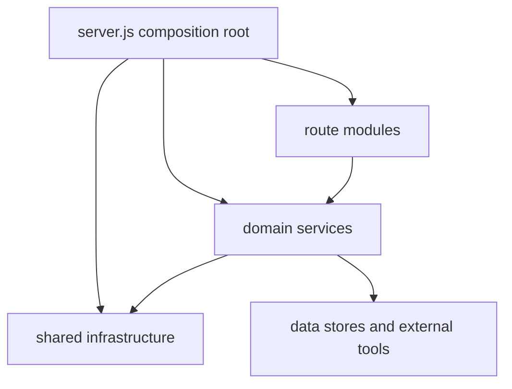
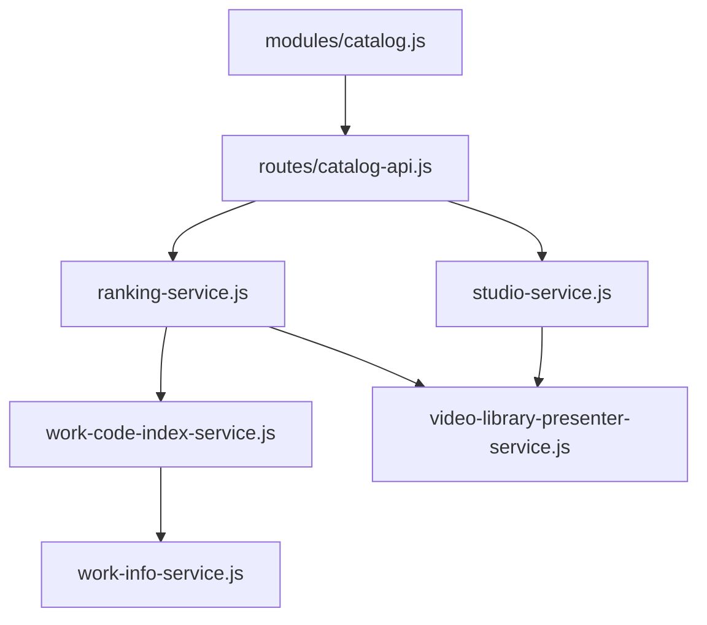

# FanHao Server Architecture

FanHao is moving from a single large server file toward a reusable local-media app framework. The migration should stay incremental: keep behavior stable, extract shared infrastructure first, then move domain modules out one at a time.

## Runtime Roles

- `server.js` is the composition root. It wires configuration, stores, core services, route modules, and startup.
- `src/server/*` contains reusable server infrastructure and domain stores/routes.
- `tools/*` contains batch jobs and heavier maintenance scripts. Long-running scan/import/transcode work should continue moving out of the request path and into tools or workers.
- `data/*` owns local state and SQLite databases.
- `public/*` and `android-client/www/*` are client surfaces.

## Core Services

Current reusable services:

- `src/server/http-app.js`: common HTTP request shell, CORS, auth gate, API/media/static dispatch.
- `src/server/access-log.js`: JSON access log writer and request timing.
- `src/server/file-server.js`: inline file serving and Range-based media streaming.
- `src/server/video-probe-service.js`: ffprobe-backed media probing, LRU probe cache, and browser playback mode/playinfo decisions.
- `src/server/image-reader-cache-service.js`: image-reader cache status, touch throttling, cleanup scheduling, and size-based eviction.
- `src/server/library-paths.js`: root labels, root-relative paths, source-path resolution, open-root allowlist.
- `src/server/local-open-service.js`: safe local file/folder target resolution and OS-level open scheduling for trusted local/LAN requests.
- `src/server/root-config.js`: environment/default root parsing for library, gallery, photo sets, and short videos.
- `src/server/app-config-service.js`: app configuration defaults, normalization, load/save, public payloads, and image-reader cache limits.
- `src/server/user-state-service.js`: local user-state defaults, normalization, and JSON persistence for favorites, manual covers, and playback progress.
- `src/server/request-io.js`: request body parsing, JSON file reads, and safe child path resolution.
- `src/server/auth.js`: local/LAN/remote/app authentication.
- `src/server/static-files.js`: static asset serving.
- `src/server/responses.js`: response helpers.
- `src/server/core-db-service.js`: core SQLite open/init lifecycle, core cache table/column compatibility setup, and table data stamp caching.
- `src/server/admin-script-service.js`: reusable admin script registry facade with public script payloads, risk labels, option validation, and command construction.
- `src/server/admin-task-service.js`: reusable process-task runner with persisted history, log capture, stop handling, and public task summaries.
- `src/server/douban-cookie-service.js`: reusable Douban cookie storage, status, normalization, and access-test helper.
- `src/server/txt-format-tool-service.js`: reusable TXT formatter tool facade with upload validation, temporary download lifecycle, formatter subprocess execution, and download serving.
- `src/server/android-update-service.js`: reusable Android update manifest/page/APK serving facade for debug and release channels.

Core services should not know about AV works, novels, short videos, actor metadata, or gallery-specific tables.

## Domain Modules

Domain modules should own their routes, store, media lookup, and task hooks where practical.

Current/near-term modules:

- `modules/admin.js`: owns admin API route mounting and keeps request-time library access current via `getLibrary`.
- `modules/android-update.js`: owns Android update manifest/APK API route mounting.
- `modules/catalog.js`: owns ranking and studio catalog API route mounting.
- `modules/short-videos.js`: owns short-video store creation plus API and media route mounting.
- `modules/novels.js`: owns novel store creation, API route mounting, and invalidation.
- `modules/gallery.js`: owns gallery API/media route mounting.
- `modules/library.js`: owns library summary/root/rescan API route mounting and keeps request-time library access current via `getLibrary`.
- `modules/local-open.js`: owns trusted local file/folder open API route mounting.
- `modules/status.js`: owns health/status API route mounting and keeps request-time library access current via `getLibrary`.
- `modules/tools.js`: owns utility/tool API route mounting such as TXT formatting.
- `modules/user-state.js`: owns user-state API route mounting and keeps request-time library access current via `getLibrary`.
- `modules/video-library.js`: owns video-library API/media route mounting and keeps request-time library access current via `getLibrary`.
- `image-library-index-service.js`: owns image-library filesystem scans, root statuses, photo/media index cache loading/saving, and cache invalidation.
- `image-library-service.js`: owns image-library public payloads, channel list filtering/sorting/facets, photo collection grouping, and gallery media public item decoration.
- `gallery-metadata-service.js`: owns gallery TV/movie metadata table reads, public metadata payloads, stable metadata keys, and metadata cover media responses.
- `gallery-media-service.js`: owns gallery media lookup, detail payloads, gallery video streaming via `media-stream-service.js`, playback progress decoration, and generated per-media cover cache.
- `manga-service.js`: owns cached manga discovery, public manga payloads, and manga image serving.
- `photo-set-service.js`: owns photo-set lookup, detail payloads, cover generation/cache, and archive image serving.
- `actor-avatar-service.js`: owns actor avatar Filetree parsing, candidate matching, avatar import/upsert, and profile cache invalidation hooks.
- `actor-movie-service.js`: owns actor movie row caching, code-key indexes, actor-movie enrichment for local works, and actor-movie missing-work payloads/search.
- `actor-profile-service.js`: owns actor profile row caching, core actor-profile reads, and public actor-profile payloads.
- `person-library-service.js`: owns local person source-path candidates and single-person library refresh/index repair.
- `person-list-service.js`: owns merged/scoped main person-list assembly for library summary responses.
- `person-merge-service.js`: owns canonical person maps, merged person records, merged aliases, and actor-profile display/search names.
- `people-scope-service.js`: owns the unified main scope plus the legacy western compatibility filter, root membership checks, and person/work scope matching.
- `ranking-service.js`: owns JavDB ranking summaries, ranking row reads, ranking work payloads, and ranking missing-work search payloads.
- `studio-service.js`: owns studio/maker catalog summaries, series rows, public studio payloads, and studio detail work listings.
- `video-library-image-service.js`: owns core image row reads and public person-avatar/work-cover payloads used by video-library presentation and media responses.
- `media-response-service.js`: owns inline image/blob responses, local image cache reads/writes, actor avatar/work cover/core-image serving, remote-image cache serving, and remote-image prewarm queueing.
- `media-stream-service.js`: owns local video Range responses, ffmpeg remux/transcode streaming, and info-file preview responses.
- `playback-progress-service.js`: owns video/work progress shaping, watch-history aggregation, progress persistence validation, and playback-related user-state summary fields.
- `favorite-state-service.js`: owns favorite folder counts, favorite payload shaping, favorite folder creation, favorite movement, and favorite toggle persistence.
- `manual-cover-state-service.js`: owns manual work cover state, person avatar cover selection/upload payloads, and manual person-avatar writes to core `images`.
- `admin-settings-service.js`: owns admin configuration and Douban cookie payloads, including cookie save/test response shaping.
- `admin-actor-avatar-service.js`: owns admin actor-avatar import/candidate/apply payloads, actor-avatar config updates, person-id normalization, and error payloads with current config.
- `admin-person-service.js`: owns admin person mapping payloads and single-person rescan response assembly.
- `admin-task-orchestration-service.js`: owns admin task/script list, stop, and generic script-start payload orchestration.
- `admin-maintenance-task-service.js`: owns special admin maintenance task orchestration/status for JavDB actor-movie refresh and generated cover backfill, including command arguments and cache invalidation.
- `admin-core-mutation-service.js`: owns admin-facing core database writes, currently actor profile upsert, person merge, local-folder actor correction, move-to-person target creation, directory moves, and core path/person-link updates.
- `core-library-service.js`: owns core local-library read-model loading, folder/person fallback matching, core person fallback records, and core missing-work payloads.
- `core-library-sync-service.js`: owns scan-to-core work matching and local work/file persistence into `local_works` and `local_files`.
- `local-library-index-service.js`: owns library load/refresh orchestration, cache placeholders, scan/core fallback selection, scan-to-core sync facade methods, and derived-cache invalidation hooks.
- `local-library-scan-service.js`: owns filesystem fallback scanning, media file collection, work construction, cover choice for scanned works, and scan index file registration.
- `work-code-index-service.js`: owns work code-key extraction, local work code-key sets, local work lookup by code key, and related invalidation.
- `work-info-service.js`: owns work-info row caching, core work-info reads, public work-info summaries, public work-info metadata, and work-info invalidation.
- `work-query-service.js`: owns video-library work listing/search payload assembly plus shared filtering, sorting, facets, and pagination for work collections.
- `work-detail-service.js`: owns video-library work detail payloads, playback info payloads, and info-file responses.
- `person-detail-service.js`: owns video-library actor profile/person detail payloads, person missing-work assembly, actor-row merging, person covers, merge actions, and person-local delete HTTP payloads.
- `video-library-presenter-service.js`: owns public person/work/media payload shaping, person fallback avatars, work-cover avatars, and availability decoration for video-library responses.
- `work-local-mutation-service.js`: owns local work marker folder renames, single-work and person-batch local file deletion, empty parent cleanup, and `local_works`, `local_files`, and work image path updates.
- `work-cover-mutation-service.js`: owns generated work-cover status, ffmpeg frame extraction, cover writes to core `images`, and cover-related cache invalidation.
- `work-mutation-service.js`: owns video-library mutation HTTP payloads while delegating cover generation, local marker/delete, actor correction, move-to-person, and manual cover writes to focused services.
- `routes/android-update-api.js`: owns Android update manifest/APK HTTP routing.
- `routes/catalog-api.js`: owns ranking and studio catalog HTTP routing.
- `routes/library-api.js`: owns library summary, library roots, and rescan HTTP routing.
- `routes/local-open-api.js`: owns trusted local file/folder open HTTP routing.
- `routes/status-api.js`: owns health/status HTTP routing.
- `routes/user-state-api.js`: owns favorites, favorite-folder, watch-history, and playback-progress HTTP routing.
- `routes/video-library-api.js`: owns current work listing, search, work detail/actions, playback info, info-file reads, actor profile, and person-detail HTTP routing while delegating video-library behavior to focused services.
- `routes/video-library-media.js`: owns actor avatar, work cover, core image, local image, and local video media routing.
- future `admin` module for script option normalization, admin-only workflows, and task-specific invalidation hooks

Route modules should receive dependencies explicitly instead of importing global state from `server.js`.

## Dependency Direction

The intended direction is:

Rules for keeping the graph reusable:

- `server.js` may wire services together, but should not own SQL-heavy domain behavior, public payload shaping, or cache-specific invalidation details.
- Route modules should remain thin HTTP adapters: path matching, request parsing, permission checks, and response sending.
- Domain services may depend on lower-level helpers injected by `server.js`, but should not import each other directly. If two services need to collaborate, wire the collaboration in `server.js`.
- Shared infrastructure must stay domain-agnostic. It should not mention AV works, actors, studios, rankings, galleries, novels, or short videos.
- Cache ownership should live with the service that owns the computed data. Invalidation should be exposed as a small service method such as `invalidate()` or `invalidateSearch()`.

## Current Video-Library Graph

The video-library graph is now split into smaller service clusters:

```mermaid
flowchart TD
  VLModule["modules/video-library.js"]
  VLApi["routes/video-library-api.js"]
  VLMedia["routes/video-library-media.js"]

  WorkQuery["work-query-service.js"]
  WorkDetail["work-detail-service.js"]
  WorkMutation["work-mutation-service.js"]
  PersonDetail["person-detail-service.js"]
  PersonLibrary["person-library-service.js"]
  Presenter["video-library-presenter-service.js"]
  MediaResponses["media-response-service.js"]
  MediaStreams["media-stream-service.js"]
  PlaybackProgress["playback-progress-service.js"]
  FavoriteState["favorite-state-service.js"]
  ManualCoverState["manual-cover-state-service.js"]
  AdminCoreMutation["admin-core-mutation-service.js"]
  WorkLocalMutation["work-local-mutation-service.js"]
  WorkCoverMutation["work-cover-mutation-service.js"]
  Images["video-library-image-service.js"]

  PeopleScope["people-scope-service.js"]
  PersonMerge["person-merge-service.js"]
  ActorProfile["actor-profile-service.js"]
  ActorMovie["actor-movie-service.js"]
  CoreLibrary["core-library-service.js"]
  LocalIndex["local-library-index-service.js"]
  CoreSync["core-library-sync-service.js"]
  LocalScanner["local-library-scan-service.js"]
  WorkCodeIndex["work-code-index-service.js"]
  WorkInfo["work-info-service.js"]
  Ranking["ranking-service.js"]
  Studio["studio-service.js"]

  VLModule --> VLApi
  VLModule --> VLMedia
  VLApi --> WorkQuery
  VLApi --> WorkDetail
  VLApi --> WorkMutation
  VLApi --> PersonDetail
  VLMedia --> Images
  VLMedia --> MediaResponses
  VLMedia --> MediaStreams
  VLApi --> PlaybackProgress
  VLApi --> FavoriteState
  VLApi --> ManualCoverState
  VLApi --> AdminCoreMutation

  WorkQuery --> Presenter
  WorkQuery --> PeopleScope
  WorkQuery --> ActorMovie
  WorkQuery --> Ranking
  WorkQuery --> PlaybackProgress
  WorkQuery --> FavoriteState
  WorkDetail --> Presenter
  WorkMutation --> Presenter
  WorkMutation --> AdminCoreMutation
  WorkMutation --> WorkLocalMutation
  WorkMutation --> ManualCoverState
  WorkMutation --> WorkCoverMutation
  PersonDetail --> Presenter
  PersonDetail --> PersonMerge
  PersonDetail --> ActorMovie
  PersonDetail --> CoreLibrary
  PersonDetail --> PeopleScope
  PersonDetail --> ManualCoverState
  PersonLibrary --> LocalIndex
  PersonLibrary --> LocalScanner

  LocalIndex --> CoreLibrary
  LocalIndex --> CoreSync
  LocalIndex --> LocalScanner
  LocalScanner --> LocalIndex
  CoreLibrary --> LocalScanner
  Presenter --> Images
  MediaResponses --> Images
  Presenter --> PlaybackProgress
  Presenter --> FavoriteState
  Presenter --> ManualCoverState
  Presenter --> ActorProfile
  AdminCoreMutation --> ActorProfile
  AdminCoreMutation --> ActorMovie
  AdminCoreMutation --> PersonMerge
  AdminCoreMutation --> CoreLibrary
  WorkLocalMutation --> CoreLibrary
  WorkCoverMutation --> WorkInfo
  Presenter --> WorkInfo
  ActorMovie --> WorkCodeIndex
  ActorMovie --> WorkInfo
  CoreLibrary --> WorkCodeIndex
  CoreSync --> WorkCodeIndex
  Ranking --> WorkCodeIndex
  WorkCodeIndex --> WorkInfo
  Studio --> ActorMovie
```

Catalog routes use a parallel cluster:

This shape keeps catalog concepts (`ranking`, `studio`) out of the video-library route layer, while still allowing them to reuse public work payloads and code-key matching.

## Remaining Server.js Ownership

`server.js` should continue shrinking toward only composition and truly shared glue. The biggest remaining ownership pockets are:

- Image-gallery database lifecycle and schema upgrade helpers.
- Person/work helper wrappers that are stable enough to remove in later cleanup passes.
- Library load/refresh orchestration around `local-library-index-service.js` is now isolated; the remaining database lifecycle pocket in `server.js` is the image-gallery schema setup.
- Some media serving bridge glue around top-level route dispatch and legacy helper compatibility.
- Remaining scan/invalidation orchestration glue around long-running maintenance paths.

These areas are not all equally urgent. Prefer extracting the ones that reduce dependency pressure on several services at once.

## Migration Order

1. Keep extracting low-risk core utilities from `server.js`.
2. Move small, already-isolated domains first: short videos and novels.
3. Split remaining gallery internals into metadata services and worker/tool boundaries.
4. Split video-library last; it currently owns the largest graph of people, works, covers, search, progress, and metadata.
5. Move slow operations to worker/tool boundaries: scans, image indexes, archive extraction, cover generation, ffprobe/ffmpeg probes, and metadata imports.

## Guardrails

- Preserve existing API responses unless a migration explicitly changes an endpoint.
- Keep request-time work fast; avoid recursive scans, large synchronous reads, and ffmpeg probes in hot paths.
- Prefer explicit dependency injection for modules.
- Add smoke checks for `/api/health` and representative module endpoints after each split.
- Do not mix unrelated UI behavior changes into server architecture changes.

## Next Iteration Backlog

Highest leverage next steps:

1. Hot-path query cleanup: cache or index expensive work facets/progress filters after the service boundaries are stable.
2. Image-gallery DB lifecycle cleanup: move gallery schema upgrade/open helpers behind a focused DB service so `server.js` keeps shrinking toward composition only.
3. Person/work helper cleanup: replace the remaining stable `server.js` wrappers with direct service injection where call sites are already fully service-owned.
4. Media route cleanup: move remaining top-level remote-image and local-image compatibility helpers into route modules or dedicated media adapters.
5. Admin route cleanup: keep any new admin endpoints behind focused services; `routes/admin-api.js` should remain only permission checks, body parsing, and response dispatch.

Backlog rules:

- Keep each extraction behavior-preserving and leave wrappers in `server.js` until call sites are stable.
- Prefer service-level smoke tests around endpoints that exercise the moved behavior.
- After two or three more extractions, remove wrappers where call sites are already fully service-owned.
