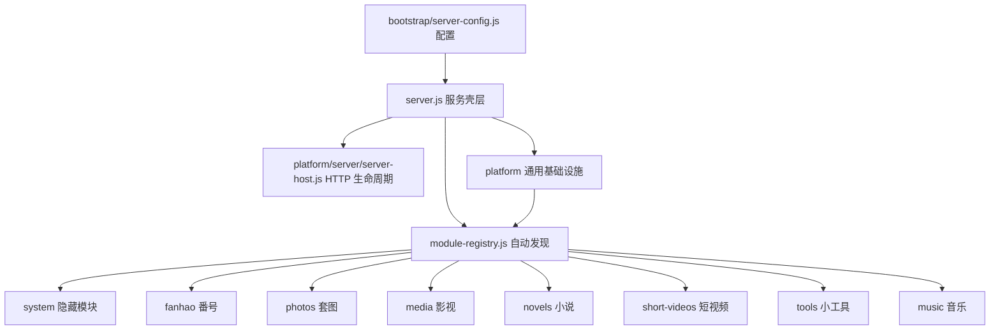
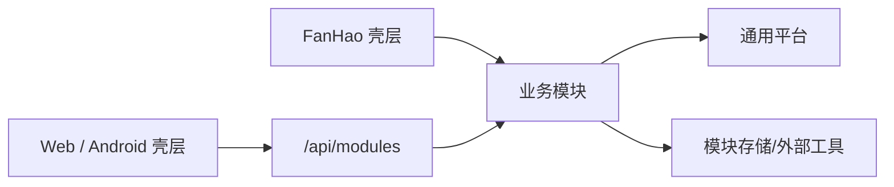

# FanHao 服务端架构

## 当前结构

FanHao 现在由启动配置、服务壳层、反射式模块注册表和若干业务模块组成。`server.js` 不再手工挂载各模块路由；它读取 `src/bootstrap/server-config.js` 的统一配置、创建共享依赖后，交给 `src/fanhao/module-registry.js` 扫描 `src/modules/*/module.js`，再按模块声明的顺序统一启动和分发。HTTP Server、监听地址、信号处理和优雅停机由 `src/platform/server/server-host.js` 负责。



主要目录：

- `src/bootstrap/`：启动配置和环境变量解析，不引用具体业务模块。
- `src/fanhao/`：模块发现、校验、排序、生命周期和统一分发。
- `src/modules/<id>/module.js`：模块唯一入口和公开描述符。
- `src/modules/<id>/server/`：模块自己的路由、运行时、存储和领域服务。
- `src/platform/server/`：HTTP、鉴权、文件响应、静态资源和媒体流等通用能力。
- `public/modules/<id>/`：Web 页面控制器。
- `public/app.js`：只负责 FanHao 番号页面；`public/standalone-app.js` 与 `public/js/standalone-host.js` 为图库/影视、小说、音乐和小工具提供独立页面宿主。
- `android-client/www/modules/<id>/`：Android WebView 页面控制器和模块样式。

旧的 `src/server/` 已不再承载源码；`npm run verify:modules` 会阻止代码重新流回该目录。

## 模块发现与装配

模块注册表只识别目录根部的 `module.js`。入口必须导出 `moduleDefinition`，可选导出 `createModule(context)`。目录名与 `moduleDefinition.id` 必须一致，否则启动失败。

注册表执行以下步骤：

1. 扫描并动态导入每个 `src/modules/*/module.js`。
2. 校验 id、标题、顺序、客户端入口和重复 id。
3. 调用 `createModule` 创建模块运行时。
4. 按 `order` 排序，依次执行 `start()`。
5. 对每个请求依次调用 `routeApi()` 或 `routeMedia()`，首个返回 `true` 的模块接管请求。
6. 通过 `/api/modules` 向 Web 和 Android 壳层提供可见模块清单；两端导航据此生成，不再维护两份固定业务列表。Web 顶层模块统一使用 `_blank` 链接，每次切换都会在新的浏览器标签页或窗口加载独立文档并保留原页面；模块内部的筛选、详情和历史记录仍可使用客户端路由。

运行时可实现的协议：

```js
{
  routeApi(req, res, url),
  routeMedia(req, res, url),
  start(),
  stop(),
  invalidate(reason)
}
```

这些方法均为可选。路由方法处理请求后返回 `true`，未匹配返回 `false`。

## Web 宿主边界

顶层 Web 页面按产品形态选择入口：`public/fanhao-app.js` 加载 `public/app.js`，后者只拥有 FanHao 番号状态与交互；图库/影视、小说、音乐和小工具统一经 `public/standalone-app.js` 启动，由 `public/js/standalone-host.js` 按当前路由动态加载对应页面模块。短视频保留自己的独立入口 `public/short-video-app.js`。宿主只提供路由、共享 UI 依赖和生命周期，不应重新吸收模块领域状态。

## 模块边界

当前可见业务模块按产品形态划分：

| 模块 | 产品形态 | 服务端所有权 |
| --- | --- | --- |
| `fanhao` | 番号 | 人物、作品、榜单、片商、收藏、观看记录和本地番号库 |
| `photos` | 套图 | 套图、写真、漫画和图片读取 |
| `media` | 影视 | 电影/电视剧元数据、详情、封面和媒体播放 |
| `novels` | 小说 | 小说 SQLite、书库、章节和阅读进度 |
| `short-videos` | 短视频 | 短视频 SQLite、来源同步、信息流、作者和播放 |
| `tools` | 小工具 | TXT 格式化和离线小游戏入口 |
| `music` | 音乐 | 音乐 SQLite、扫描、播放队列和歌单 |

`content-index` 是套图与影视复用的隐藏只读索引模块；`system` 是状态、管理、更新和本机能力的隐藏模块。共享不是把业务重新揉在一起：隐藏模块只提供明确的底层能力，可见模块仍拥有自己的 API 和媒体路由。

依赖方向固定为：



- `src/platform` 不得引用任何具体业务模块。
- 一个模块不得直接导入另一个可见业务模块的内部文件；确需共享时抽成隐藏能力模块或通用平台接口。
- 路由只负责匹配、输入、权限和响应；领域判断与缓存归模块服务所有。
- 慢速扫描、导入、封面生成和转码继续放在 `tools/` 或后台作业中。
- `server.js` 目前仍负责较多历史服务的依赖装配，这是下一阶段应继续收缩的兼容区；新功能不得继续向其中增加领域实现。

## 验证护栏

每轮结构调整至少运行：

```powershell
npm run verify:repo-hygiene
npm run verify:modules
npm run verify
```

`verify:repo-hygiene` 会阻止生成目录、服务抓取副本和含 NUL 字节的源码进入版本库。`verify:modules` 会检查七个可见业务模块、双端客户端声明、稳定排序、各自的 `server/` 目录、旧目录清空、模块化 CSS，以及启动配置和 HTTP 生命周期没有重新流回 `server.js`。完整验证后还应启动服务，检查 `/api/health`、`/api/modules` 和各模块代表接口。

## 后续收缩顺序

1. 把 `server.js` 中仍然集中的 FanHao 领域服务构造迁到 `src/modules/fanhao/server/composition.js`，让壳层最终只装配平台上下文和模块注册表。
2. 拆分 `src/modules/short-videos/server/store.js` 的 schema、repository、同步、查询和封面职责。
3. 拆分 `public/modules/short-videos/short-video-page.js` 的数据控制、播放器生命周期、交互和视图，但保持模块入口与 URL 不变。
